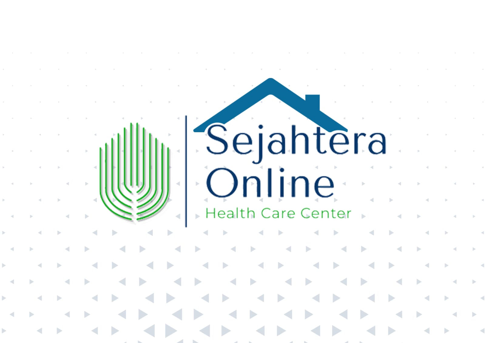

# Capstone-Project-FHI

<h3>SEJAHTERA ONLINE </h3>

<h4>SO (SEJAHTERA ONLINE) adalah website yang bertujuan untuk memberikan banyak informasi tentang kesehatan yang dibutuhkan oleh seluruh masyarakat di Indonesia dan informasi yang kami sajikan juga mudah untuk di pahami oleh orang awam<h4>

 Aplikasi ini Dibuat salah satu syarat untuk memenuhi kelulusan dari program MSIB X Dicoding.

## Team Project

<h3>Team ID : C23-M4024</h3>
<h3>Nama Anggota Kelompok : </h3>
1.    F125XB274 – Eka Maha Putra Sembiring  
2.    F064XB103 – Muhammad Tsaqib 
3.  	F015YB485 - Gabrielle Shierly  
4.   F026XB465 – Andika Syahrul Firdan  
  
## Tema : Kesejateraan Penduduk
 
## Judul Proyek : SO (Sejahtera Online)

## User-accessible Link

## Github Repo Link

https://github.com/hoaxzz/capstone-proyek

# About FoodIntake

**FHI (Family healthing Information)** adalah website yang bertujuan untuk memberikan banyak informasi tentang kesehatan yang dibutuhkan oleh seluruh masyarakat di Indonesia dan informasi yang kami sajikan juga mudah untuk di pahami oleh orang awam. Nantinya terdapat juga fitur-fitur yang dapat dimanfaatkan oleh pengguna untuk terus dapat menjaga kesehatannya, Kami memilih tema ini karena masih banyak masyarakat yang kurang peduli dan teredukasi dalam menjaga kesehatannya.

# Project Resource

Berikut Resources yang dibutuhkan dalam pengembangan Website FHI (Family healthing Information):

<ul>
  <li>Bahasa Pemograman :</li>
    <ul>
      <li>CSS</li>
      <li>Javascript</li>
      <li>Php</li>
    </ul>
  <li>Framework :</li>
    <ul>
      <li>Bootstrap</li>
    </ul>
  <li>Database :</li>
    <ul>
      <li>Public API</li>
    </ul>
  <li>Library :</li>
    <ul>
      <li>Node Package Manager</li>
      <li>Eslint : airbnb</li>
    </ul>
  <li>Tools :</li>
    <ul>
      <li>Virtual Studio Code</li>
      <li>Font Awesome</li>
      <li>Google Chrome</li>
    </ul>
  <li>Manajemen Proyek :</li>
    <ul>
      <li>Google Meet</li>
      <li>WhatssApp</li>
      <li>GitHub</li>
    </ul>
</ul>

# Daftar Pustaka

<ul>
  <li>
Alodokter.com(2022). “Kenali 12 Indikator Keluarga Sehat Menurut Kemenkes RI”. Diakses 18 November 2022, dari https://www.alodokter.com/kenali-12-indikator-keluarga-sehat-menurut-kemenkes-ri.
</li>
  <li>
Medi-Call(2019). “Berikut Macam-Macam Pelayanan Kesehatan untuk Lansia”. Diakses 18 November 2022, dari https://medi-call.id/blog/pelayanan-kesehatan-untuk-lansia/
</li>
</ul>
